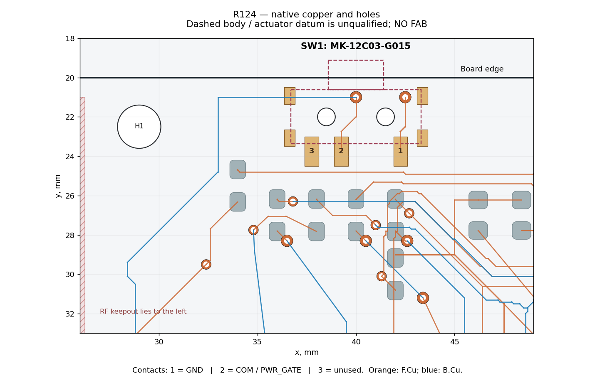

# SW1 — approved MK-12C03-G015 drawing review

**Approved MPN is retained. Assembly qualification is HOLD.** The electrical diagram makes terminal 2 the common contact; the closed pair shown is 1–2. R124 connects 2 to PWR_GATE, 1 to GND and leaves 3 explicitly unused. Slide direction and maintained/latching behavior of the purchased suffix still require confirmation from its qualified drawing/sample.

Both one-page manufacturer drawings were downloaded and visually inspected. The exact A0 PDF carries G-Switch manufacturer identification and is publicly hosted by a distributor; the family X1 PDF is linked from G-Switch's own product site. Manufacturer geometry is used; reseller prose is not used as a mechanical specification.

| Drawing | Date / revision | Signal lands | Locator holes | Bracket solder lands |
| --- | --- | --- | --- | --- |
| [MK-12C03-G015](https://cdn.semikey.com/upload/pdfs/a6/85/a685b04beffe80627230619bb0c8ae8e.pdf) | 2022-11-01 / A0 | Three 0.70 × 1.50 mm; contact pitches 3.00 and 1.50 mm | Two Ø0.90, pitch 3.00 mm | Omitted from the recommended layout despite visible metal cover attachment features |
| [MK-12C03-GXXX](https://www.dg-switch.com/uploads/soft/200615/%E5%93%81%E8%B5%9EMK-12C03-GXXX.pdf) | 2019-05-29 / X1 | Dimensions differ from A0; 0.90 mm width and overlapping vertical callouts require clarification | Two Ø0.90, pitch 3.00 mm | Four; 0.55 × 0.85 mm derived from the 7.30 overall / 6.20 inner horizontal extents and 3.00 vertical extent |

Source SHA256 values:

- A0: `4254ee2080636765128efc54139ddafcc759de219cac106f31eaa8772fe226ac`
- X1: `2b86195ac34db4b0c37ca28da815c563905091292ff00f13f64073cefbed9214`

R124 uses A0 signal/locator geometry and the four X1 bracket lands as an **engineering review footprint**, not a supplier-approved union. Local signal centres are 1: (−2.25,−1.75), 2: (+0.75,−1.75), 3: (+2.25,−1.75) mm. Locator centres are (±1.50,0); bracket centres are (±3.375,±1.075) mm. The asymmetric common position matters: three evenly spaced pads would be wrong.

The body envelope is nominally 6.60 × 2.75 mm and currently assumes the locator line is at the body's Y centre. That datum is not dimensioned sufficiently to grant enclosure signoff. The 1.50 actuator extension and 1.50 travel envelope are illustrated nominally; **0.875 mm calculated projection outside the PCB is an assumption-based envelope, not a certified fit**. Generic product-page momentary/travel text conflicts with the exact drawing and is not used to declare switch retention or travel qualified.

## Exact information needed to close the HOLD

1. A controlled PCB recommended land-pattern drawing or native CAD for the exact **MK-12C03-G015** production suffix, containing all three contacts, four case lands and both locator holes, with tolerances and drawing revision.
2. Resolution of A0/X1 signal-land differences and the missing bracket pads in A0.
3. Dimensioned locator-to-body/actuator datums, horizontal throw and knob height/projection; maintained/latching state and which physical direction closes 1–2.
4. Accepted drill/mask/paste/tenting and placement tolerances from the assembler, followed by enclosure review and sample OFF/ON continuity measurement.

The electrical/native regression guard already passes. Closing these mechanical/source gates is required before calling SW1 assembly-ready.

## Native geometry overview

Generated from exported native pad polygons and tracks; dashed body/actuator outlines are explicitly assumption-based. Orange is F.Cu and blue is B.Cu. Ground-zone continuity is checked separately against native filled polygons.
